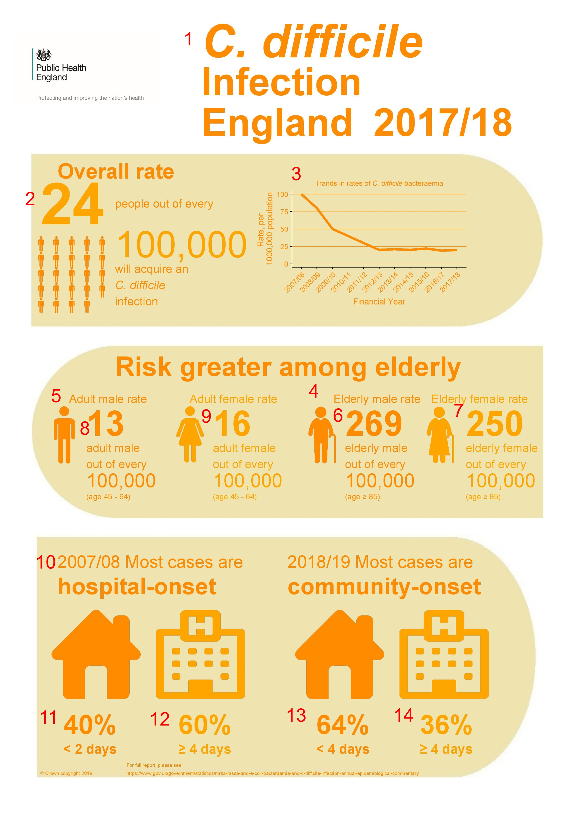

# Infographics

A simple script in R to produce infographics style PDFs for Healthcare Associated Infection (HCAI) reports.

### Prerequisites

This script requires R/R studio to be already installed. Additionally, the following packages need to be installed and loaded:  
* useful  
* grid  
* magick  
* ggplot2  
* cowplot  
* stringr  
* RColorBrewer  
* Cairo  
* gridExtra  
* ggrepel  

## Running the script

To produce PDFs the user need to configure the script variables.  
As an example to get the following:   
  

the user would need to provide the following details:

* 1) Info_type <-  1 
* 2) rate_number <-  24 
* 3) plot_data <- data.frame(years = c("2007/08", "2008/09", "2009/10", "2010/11", "2011/12", "2012/13", "2013/14", "2014/15", "2015/16", "2016/17", "2017/18"),
                          rate = c(100, 07, 60, 50, 40, 30, 20, 22, 20, 18, 20))
* 4)  rhigh_factor <- 7 
* 5) rlow_factor <- 4
* 6) rhigh_malenumber <- 269
* 7) rhigh_femnumber <- 250
* 8) rlow_malenumber <-13
* 9) rlow_femnumber <-16
* 10) previous_year <- "2007/08"
* 11) community_percent_old <- 40
* 12) hospital_percent_old <- 60
* 13) community_percent_new <- 64
* 14) hospital_percent_new <- 36

For description of the type of data/what should be inserted please see comments in the source code.  

